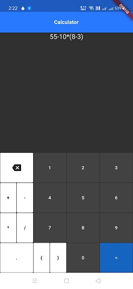
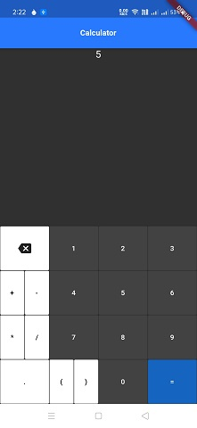

# Maths Calculator using Flutter

Following app performs general mathematical operation like addition,subraction,multiplication and division. It has a friendly User Interface for easier interaction.

## Interface
  

## File Description
lib/main.dart contain all the source code like how the widget tree is implemented and how the expression change its state when it recieve various input from the user  
pubspec.yaml contain list of dependencies of the project